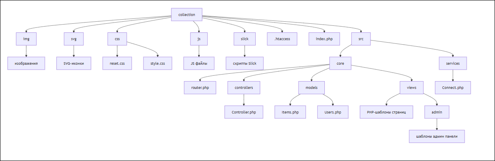
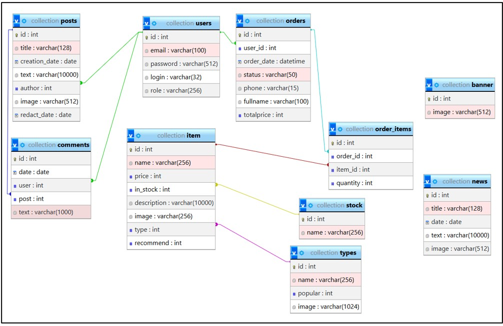
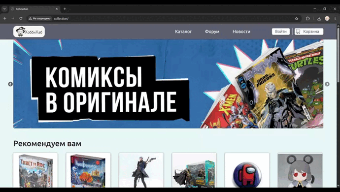

# Интернет-сервис по продаже коллекционных предметов

Локальное многостраничное динамичное веб-приложение, построенное по архитектурному паттерну MVC. Проект был разработан весной 2025 года в качестве **Выпускной квалификационной работы** для Аэрокосмического Колледжа при СибГУ им. академика М.Ф. Решетнева.

## `Стек`
* ***Backend:*** PHP
* ***Frontend:*** HTML5, CSS3, JavaScript (Slick)
* ***База данных:*** MySQL
* ***Архитектура:*** MVC с кастомной маршрутизацией

## `Функционал приложения`
* **Роутинг:** Реализована маршрутизация страниц на стороне сервера с помощью PHP.
* **Управление данными (CRUD):** Полный цикл работы с пользователями и товарами через SQL-запросы.
* **Динамический контент:** Генерация страниц на основе данных из БД и обработка форм с помощью суперглобальных массивов (`$_GET`, `$_POST`, `$_SESSION`).
* **Авторизация и сессии:** Вход, регистрация, личный кабинет и разграничение прав доступа.
* **Каталог и корзина:** Просмотр карточек товаров и логика оформления заказа.
* **Форум:** Возможность создавать посты и комментировать для зарегестрированных пользователей.
* **Панель администратора:** Просмотр созданных заказов и изменение контента на сайте.

## `Архитектура проекта`
Приложение построено на базе паттерна MVC. Ниже представлена схема структуры файлов:

<p align="center">
  
</p>

## `Cтруктура базы данных`
БД состоит из 10 таблиц, она обеспечивает хранение информации о товарах, заказах, пользователях, категориях, новостях и другой информации. Таблицы нормализованы и связаны с помощью первичных (primary) и внешних (foreign) ключей.
Схема структуры базы данных и связей таблиц:

<p align="center">
  
</p>

## `Инструкция по локальному развертыванию`

Для запуска проекта вам понадобится локальный сервер (например, **XAMPP**, **Open Server** или **MAMP**).

### 1. Клонирование репозитория
```bash
git clone https://github.com/Naloxy/CollegeDiploma-WebApp.git
```

### 2. Настройка базы данных
1. Откройте панель управления вашей СУБД (например, phpMyAdmin).
2. Создайте новую базу данных (например, `collection`).
3. Импортируйте файл `collection.sql` из корневой папки проекта.

### 3. Конфигурация подключения к БД
* Откройте файл конфигурации `src/services/Connect.php`.
* Укажите ваши локальные доступы (hostname, username, password, database), например:
```php
$db = mysqli_connect(
    "127.0.0.1:3306",
    "root",
    "",
    "collection"
);
```

### 4. Запуск
Перенесите папку с проектом в директорию вашего локального сервера (например, `htdocs`) и запустите сервер.

## `Статус проекта и ВКР`
Проект успешно защищен в **Аэрокосмическом Колледже при СибГУ**. 
* **Год написания:** 2025
* **Тема:** Разработка интернет-сервиса по продаже коллекционных предметов.
* Разработка велась с нуля, от макетов до написания кода, без использования сторонних фреймворков с целью демонстрации глубокого понимания бизнес-логики веб-приложений и принципов работы веб-технологий, протокола HTTP и ООП/MVC на чистом PHP.

## `Демонстрация работы`
<p align="center">
  
</p>
